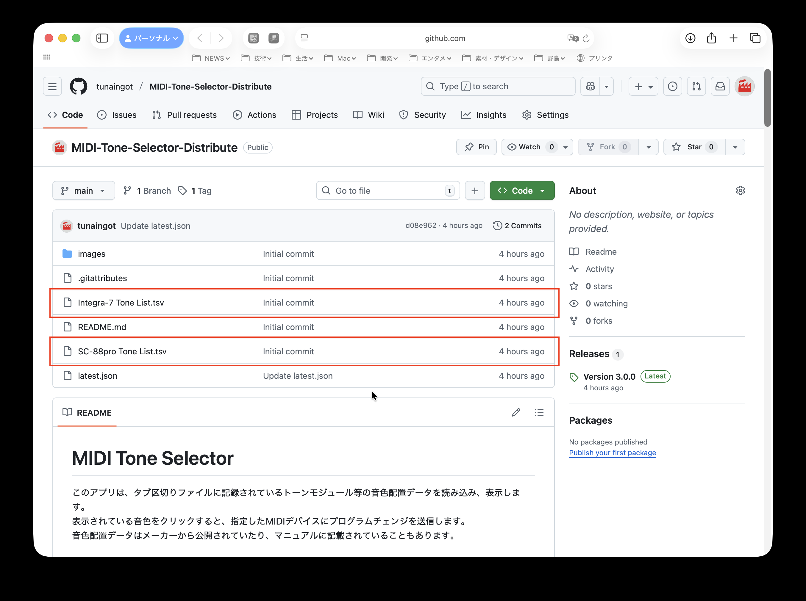
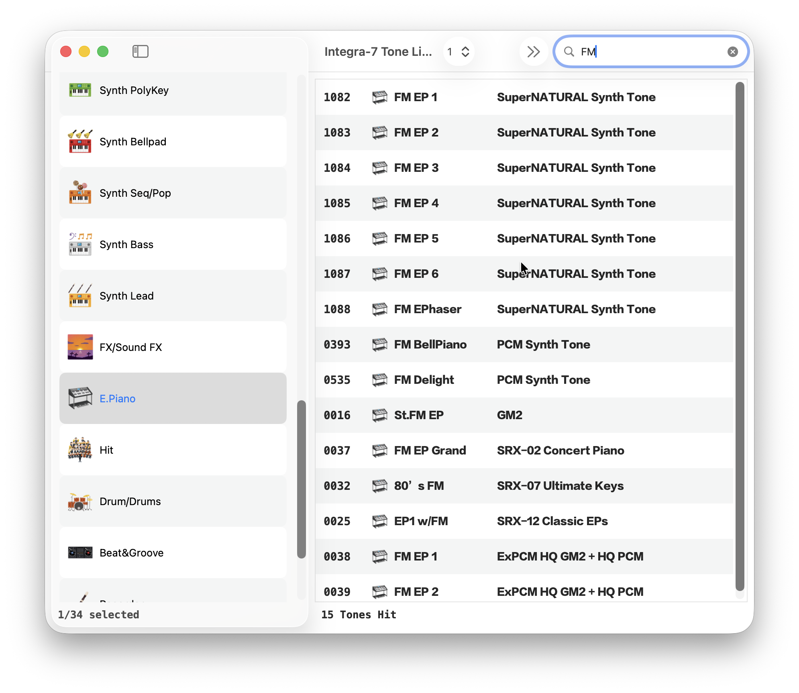
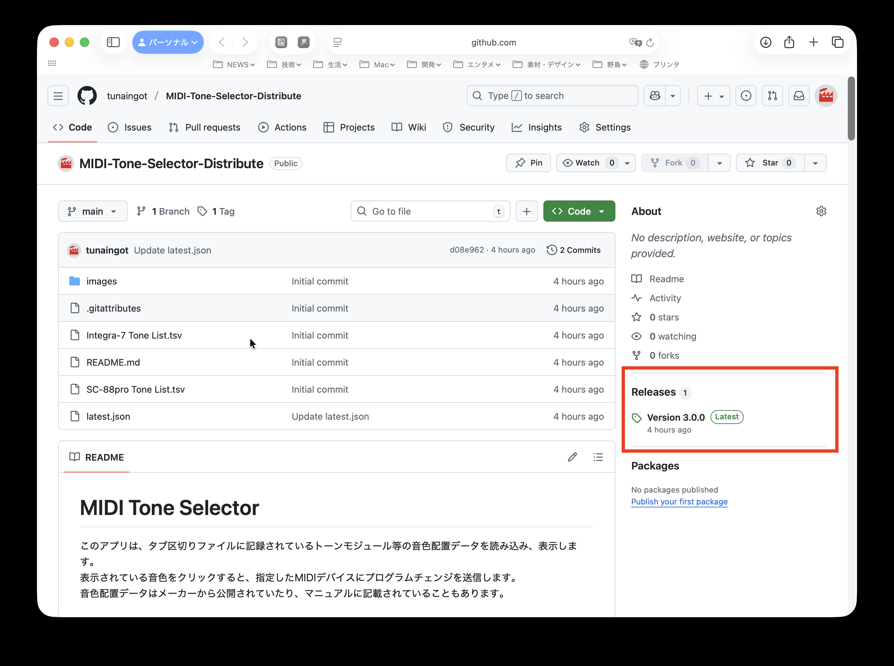
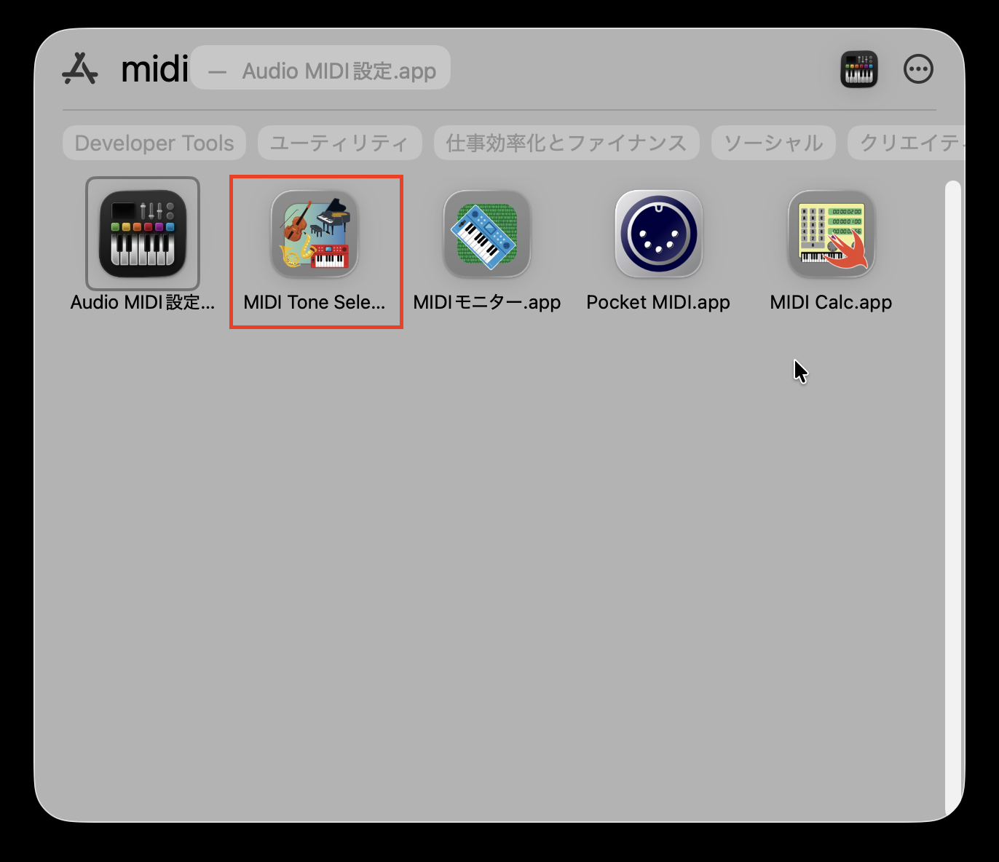
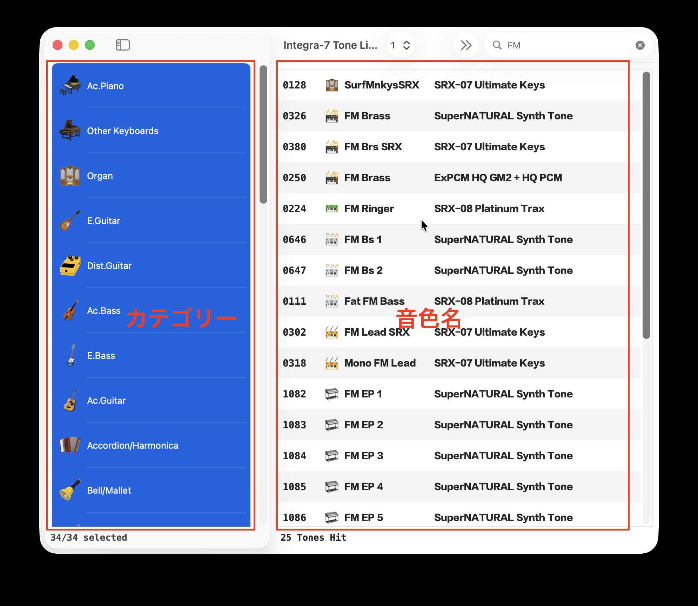
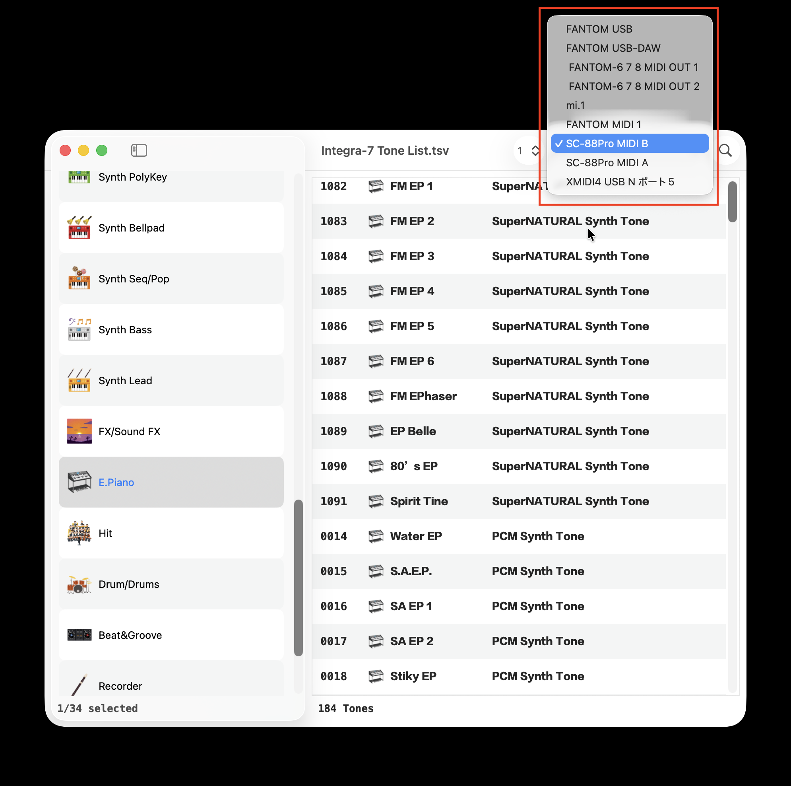
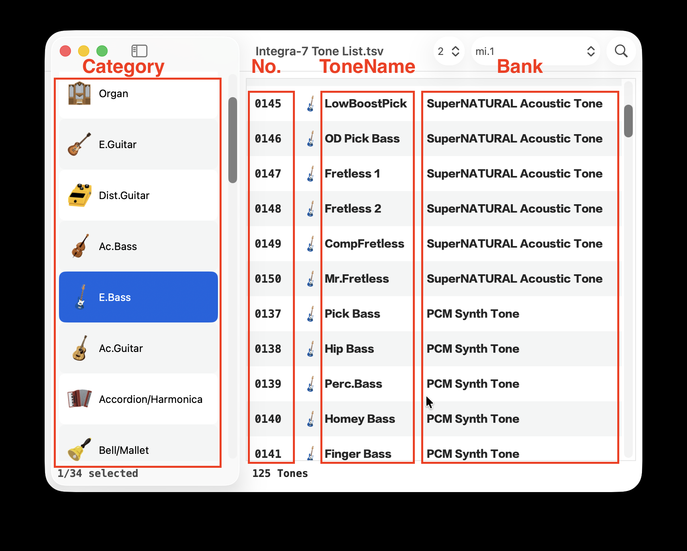

# MIDI Tone Selector

このアプリは、タブ区切りファイルに記録されているトーンモジュール等の音色配置データを読み込み、表示します。  
表示されている音色をクリックすると、指定したMIDIデバイスにプログラムチェンジを送信します。  
音色配置データはメーカーから公開されていたり、マニュアルに記載されていることもあります。  

# 音色リスト
音色配置データは今後不定期に無償で提供する予定です。\
ダウンロードされるファイルには、ここに掲載されているパッチリストを同梱しています。\
必要であれば、このページのソースのリストからタブ区切りファイルを個別にダウンロードしてください。

## 現在提供している音色リスト
| File Name | Instrument Name | Maker |
| --------- | --------------- | ----- |
| Integra-7 Tone List.tsv | Integra-7 | Roland |
| SC-88Pro Tone List.tsv | SC-88 Pro | Roland |

# アプリの配布について
このアプリはAppStoreで入手したアプリと違い、自動で最新バージョンへのアップデートはされません。\
アプリ起動時に最新バージョン公開のメッセージが出たらダウンロードしてください。\
ダウンロードしたアプリは、「アプリケーションフォルダ」に移動(上書きコピー)してください。

アプリのメニューバー「Help＞MIDI Tone Selector Help」を選択すると、このウェブサイトが開きます。\
最新のアプリ、およひ古いバージョンのアプリは、このページの右側の ***Release*** からもダウンロードできます。\
リリースのページで、「**MIDI-Tone-Selector-app.zip**」をクリックするとダウンロードできます。

アプリはAppleのノータリゼーションによって認証されています。  
正式な開発者として認定されていますので、安心してアプリをお使いください。  

# アプリの起動
**MIDI Tone Selector**のアイコンをダブルクリックして起動します。  

起動直後はウィンドウが表示されません。  
音色配置データの入ったタブ区切りファイルを読み込むことで、ウィンドウが表示されます。  
サンプルで、Roland社のIntegra-7の音色配置データをこのページの上の方にあるソースリストに加えてあります。  

# アプリの画面
アプリは左側のカテゴリーと、右側の音色の二つのブロックに分かれています。  
カテゴリーを選ぶと、そのカテゴリーの属している音色が表示されます。  
カテゴリーは複数選択することができます。  
Shift + クリックで連続して選択できます。  
コマンド +　クリックで不連続の選択ができます。  

検索フィールドで音色名を絞り込むことができます。
入力した文字列を含む音色名がリストアップされます。

# MIDIデバイス設定
ウィンドウ上にある**MIDI Destination**ポップアップにMacに接続しているMIDIデバイスがリストアップされています。  
接続したいMIDIデバイスを選んでください。  

# 送信MIDIチャンネル設定
ウィンドウ上にある**Send MIDI CH**ポップアップで送信するMIDIチャンネルを選んでください。

# 音色選択
マウスでクリックすると、クリックした音色のプログラム・チェンジが送られます。  
また、カーソルの上下キーで音色を順番に選択することができます。  
音色を聴きながら選ぶときに便利です。  

# 音色の検索
検索窓を使って、表示する音色を絞り込むことができます。  
検索窓の中の文字列は、
- 音色名
- バンク名

を検索し、検索窓の文字列を含む音色をリストアップします。  
全てのカテゴリーを選択し、特定のバンク(例えばローランドのSRXシリーズなど)の音色を探す時...等に便利です。

# 音色配置データの作り方
音色配置データはテキストエディタや、Excelなどの表計算ソフトで作成可能です。\
ファイル形式は**タブ区切りテキスト**です。\
このページの上の方にあるファイルリストにあるtsvファイルを参考にすれば、容易に作成できます。

## プログラム・チェンジ番号の範囲
プログラム・チェンジ(PC)は1〜128でデータ作成してください。

## バンク・セレクトの範囲
MSB、LSBとも0〜127データ作成してください。

## tsvデータのラベルについて
下記のラベルでレコードを作成します。

| No. | MSB | LSB | PC | ToneName | Category | Bank |
| --- | --- | --- | -- | -------- | -------- | ---- |

現状、空欄は許容していませんので、すべての項目を埋めてください。\
空欄にしたい、ラベルの追加など、ご要望があればお聞かせください。  

上記以外のラベルがTSVファイルに含まれていても構いません(画面に表示されないだけです)。  
ご自身のメモ、備考などを追加するのも良いと思います。

## 音色のカテゴリについて
現状では、利用できる音色のカテゴリが決まっています。\
そのカテゴリに応じたアイコンが付きます。

対応していないカテゴリーがあっても表示・音色選択は問題なくできます。  
ただ、カテゴリーのイメージ画像が表示されませんので、ここにないカテゴリを追加したいなど、ご要望があればお聞かせください。  
|カテゴリ名|カテゴリ名|カテゴリ名|カテゴリ名|
| -------              | ---------         | --------       | ------------------- |
| Ac.Bass              | Ac.Guitar         | Ac.Piano       | Accordion/Harmonica | 
| Bass                 | Beat&Groove       | Bell/Mallet    | Brass               |
| Chromatic Percussion | Dist.Guit         | Drum           | Drums               |
| Drum Set             | E.Bass            | E.Guitar       | E.Piano             |
| Ensemble             | Ensemble Strings  | Ethnic, etc.   | Flute               |
| FX                   | Sound FX          | Guitar         | Hit                 |
| Organ                | Other Keyboards   | Percussion     | Percussive          |
| Phrase               | Piano             | Pipe           | Plucked/Stroke      |
| Pulsating            | Recorder          | Reed           | Sax                 |
| SFX                  | String/Orchestra  | Strings        | Synth Bass          |
| Synth Bellpad        | Synth Brass       | Synth SFX      | Synth Lead          |
| Synth Pad/Strings    | Synth Pad, etc.   | Synth PolyKey  | Synth Read          |
| Synth Seq/Pop        | Vox/Choir         | Wind           |                     |
