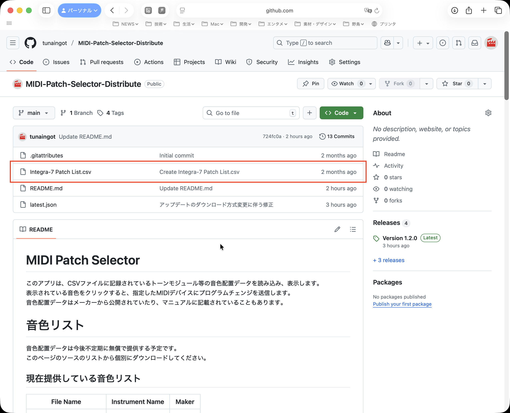
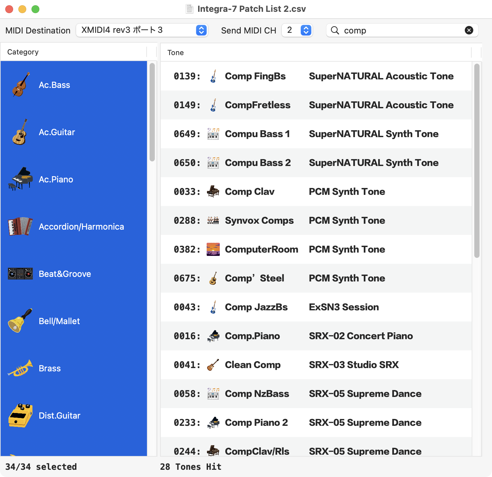
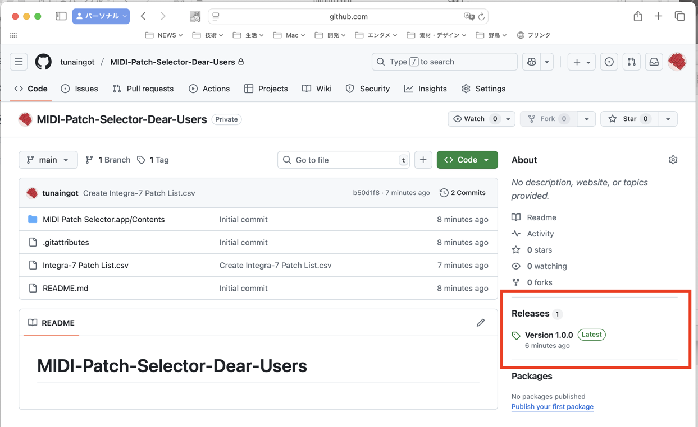
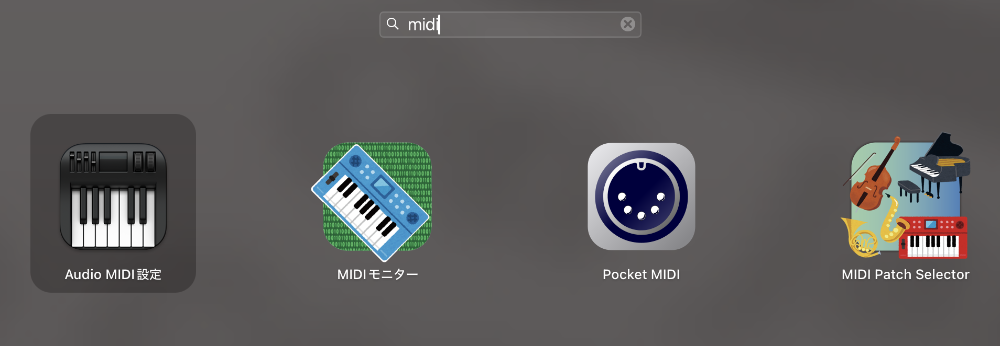
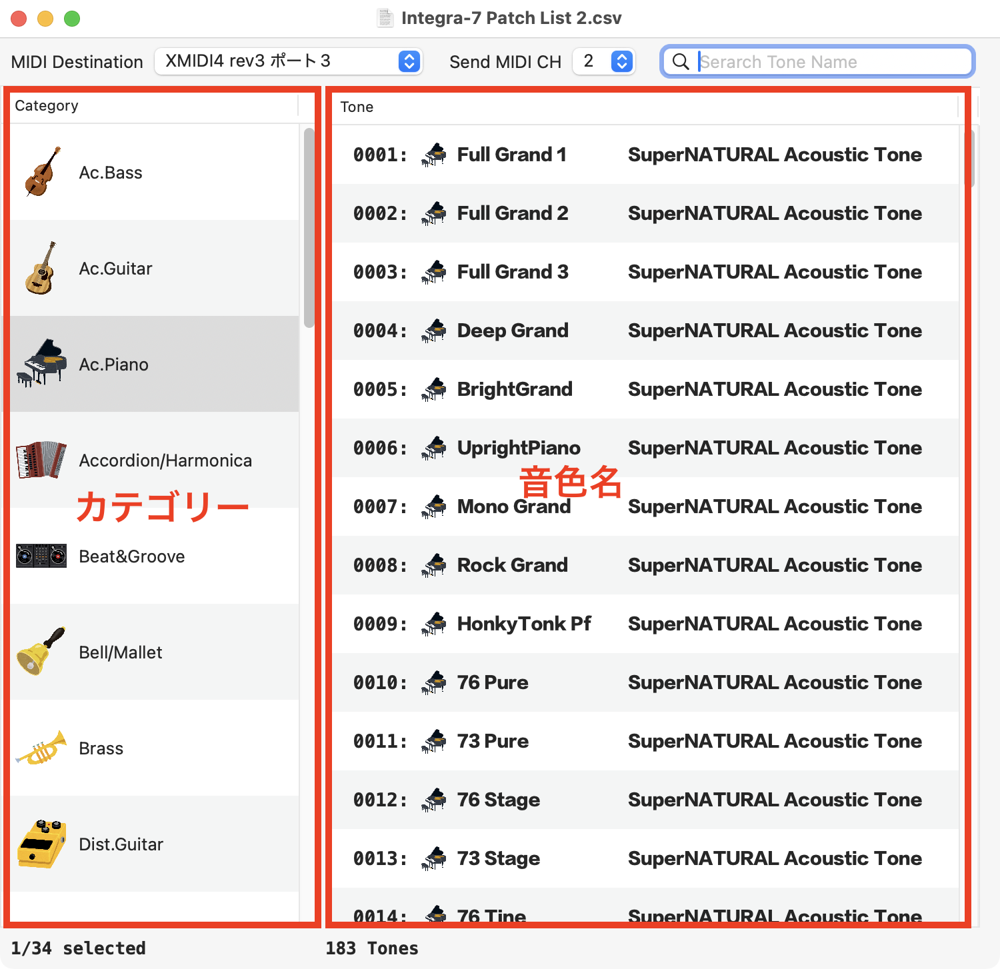
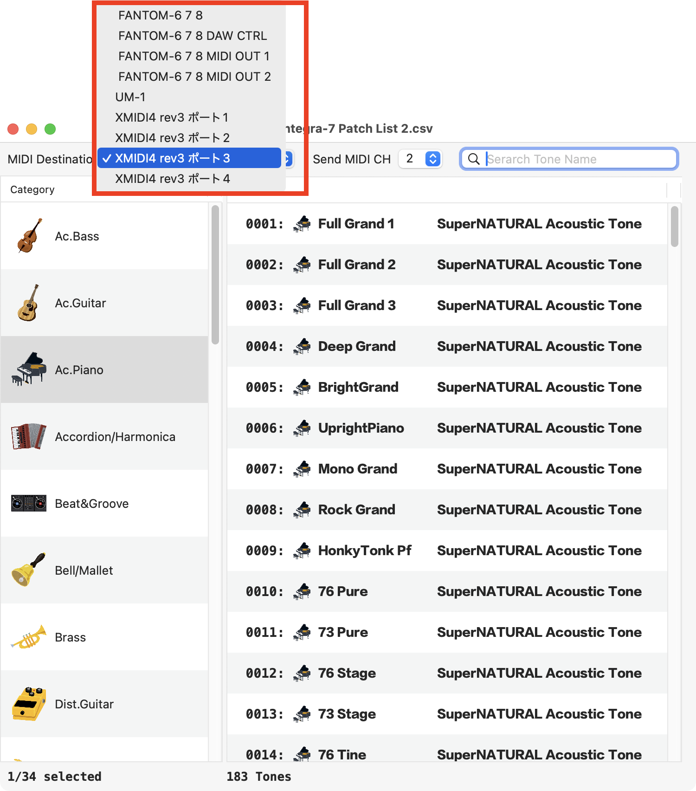

# MIDI Patch Selector

このアプリは、CSVファイルに記録されているトーンモジュール等の音色配置データを読み込み、表示します。  
表示されている音色をクリックすると、指定したMIDIデバイスにプログラムチェンジを送信します。  
音色配置データはメーカーから公開されていたり、マニュアルに記載されていることもあります。  

# 音色リスト
音色配置データは今後不定期に無償で提供する予定です。\
このページのソースのリストからcsvファイルを個別にダウンロードしてください。

## 現在提供している音色リスト
| File Name | Instrument Name | Maker |
| --------- | --------------- | ----- |
| Integra-7 Patch List.csv | Integra-7 | Roland |

# アプリの配布について
このアプリはAppStoreで入手したアプリと違い、自動で最新バージョンへのアップデートはされません。\
アプリ起動時に最新バージョン公開のメッセージが出たらダウンロードしてください。\
ダウンロードしたアプリは、「アプリケーションフォルダ」に移動(上書きコピー)してください。

アプリのメニューバー「Help＞MIDI Patch Selector Help」を選択すると、このウェブサイトが開きます。\
最新のアプリ、およひ古いバージョンのアプリは、このページの右側の ***Release*** からもダウンロードできます。\
リリースのページで、「**MIDI.Patch.Selector.app.zip**」をクリックするとダウンロードできます。

アプリはAppleのノータリゼーションによって認証されています。  
正式な開発者として認定されていますので、安心してアプリをお使いください。  

# アプリの起動
**MIDI Patch Selector**のアイコンをダブルクリックして起動します。  

起動直後はウィンドウが表示されません。  
音色配置データの入ったCSVファイルを読み込むことで、ウィンドウが表示されます。  
サンプルで、Roland社のIntegra-7の音色配置データをこのページの上の方にあるソースリストに加えてあります。  

# アプリの画面
アプリは左側のカテゴリーと、右側の音色の二つのブロックに分かれています。  
カテゴリーを選ぶと、そのカテゴリーの属している音色が表示されます。  
カテゴリーは複数選択することができます。  
Shift + クリックで連続して選択できます。  
コマンド +　クリックで不連続の選択ができます。  

検索フィールドで音色名を絞り込むことができます。
入力した文字列を含む音色名がリストアップされます。

# MIDIデバイス設定
ウィンドウ上にある**MIDI Destination**ポップアップにMacに接続しているMIDIデバイスがリストアップされています。  
接続したいMIDIデバイスを選んでください。  

# 送信MIDIチャンネル設定
ウィンドウ上にある**Send MIDI CH**ポップアップで送信するMIDIチャンネルを選んでください。

# 音色選択
マウスでクリックすると、クリックした音色のプログラム・チェンジが送られます。  
また、カーソルの上下キーで音色を順番に選択することができます。  
音色を聴きながら選ぶときに便利です。  

# 音色配置データの作り方
音色配置データはテキストエディタや、Excelなどの表計算ソフトで作成可能です。\
ファイル形式は**csv**です。\
このページの上の方にあるファイルリストにあるcsvファイルを参考にすれば、容易に作成できます。

## csvデータのラベルについて
下記のラベルでレコードを作成します。\
現状、空欄は許容していませんので、すべての項目を埋めてください。\
空欄にしたい、ラベルの追加など、ご要望があればお聞かせください。

| No. | MSB | LSB | PC | ToneName | Category | Bank |
| --- | --- | --- | -- | -------- | -------- | ---- |
## 音色のカテゴリについて
現状では、利用できる音色のカテゴリが決まっています。\
そのカテゴリに応じたアイコンが付きます。\
ここにないカテゴリを追加したいなど、ご要望があればお聞かせください。

| Ac.Bass        | Ac.Guitar         | Ac.Piano       | Accordion/Harmonica | 
| -------        | ---------         | --------       | ------------------- |
| Beat&Groove    | Bell/Mallet       | Brass          | Dist.Guitar         |
| Drum           | Drums             | E.Bass         | E.Guitar            |
| E.Piano        | Ensemble Strings  | Flute          | FX                  |
| Sound FX       | Hit               | Organ          | Other Keyboards     |
| Percussion     | Phrase            | Plucked/Stroke | Pulsating           |
| Recorder       | Sax               | Strings        | Synth Bass          |
| Synth Bellpad  | Synth Brass       | Synth Lead     | Synth Pad/Strings   |
| Synth PolyKey  | Synth Seq/Pop     | Vox/Choir      | Wind                |

